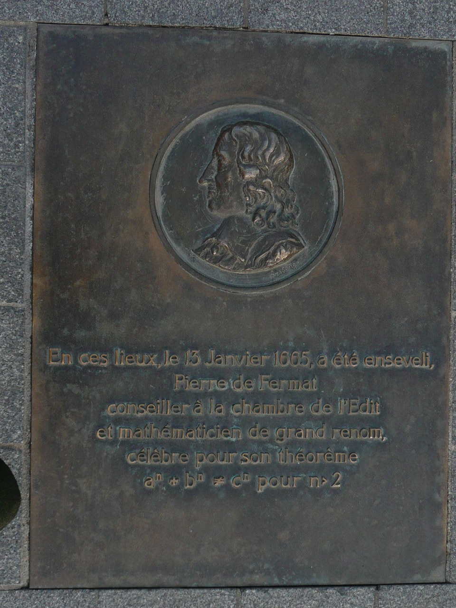
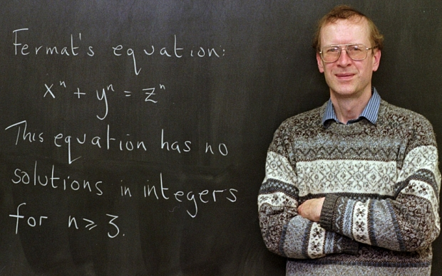

> കണക്കിലെ ഒരു കടുകട്ടിയായ പ്രശ്നം തെളിയിക്കാൻ നിങ്ങൾ എത്ര സമയം ചിലവഴിക്കും?
ഏതാനും മണീക്കൂറുകൾ? ഒരു ദിവസം? അതോ മാസങ്ങൾ? എന്നാൽ ഏഴുവർഷം ഒരു പ്രശ്നത്തിന്റെ പിന്നാലെ ആയാലോ?

എതാണ്ട് പത്ത് വർഷങ്ങൾക്ക് മുന്നെയാണ് 'ദ പ്രൂഫ്' (The Proof) എന്ന ഡോകുമെന്ററി ചിത്രം കാണാനിടയായത്. അന്നു മുതൽ ആൻഡ്ര്യൂ വൈൽസ് (Andrew Wiles) എന്ന ഗണിത ശാസ്ത്രജ്ഞൻ മനസ്സിൽ കയറിക്കൂടി. ഏതാണ്ടിതു പോലെ മനസ്സിനെ സ്വാധീനിച്ച പ്രതിഭകൾ അധികമില്ല ആധുനിക കാലത്ത്. ഒരാൾ ബ്ലൂ എൽഇഡി നിർമ്മിക്കുന്ന വിധം കണ്ടെത്തിയ ഷുജി നകാമുറയാണെങ്കിൽ (Shuji Nakamura), മറ്റൊരാൾ ഗെയിം തിയറിയിൽ സിദ്ധാന്തങ്ങൾ ആവിഷ്കരിച്ച ജോൺ നാഷ് (John Nash) ആണ്. ഇവരിൽ ആൻഡ്ര്യൂ വൈൽസിന്റെ വഴികളിലൂടെ ഒരു സഞ്ചാരം നടത്തി നോക്കാം. 

## പിയർ ഡെ ഫെർമാ

പിയർ ഡെ ഫെർമാ (Pierre de Fermat) തന്റെ ഒഴിവു സമയങ്ങളിൽ ഗണിത പ്രശ്നങ്ങൾക്ക് പരിഹാരം കണ്ടെത്താൻ ശ്രമിച്ച ഒരു അതുല്യ പ്രതിഭയായിരുന്നു. സ്വയം പ്രസിദ്ധി നേടാൻ ആഗ്രഹമില്ലാത്തതിനാൽ അദ്ദേഹം പലപ്പോഴും ഗണിത പ്രശ്നങ്ങൾ ഉന്നയിക്കുമ്പോൾ അതിന്റെ തെളിവുകൾ നൽകിയിരുന്നില്ല.

അവസാന സിദ്ധാന്തത്തെപ്പറ്റി പറയുന്നതിനു മുന്നെ ഫെർമായുടെ മറ്റു ചില സിദ്ധാന്തങ്ങളെപ്പറ്റി നോക്കാം:
1. 26 അല്ലാതെ വേറൊരു സംഖ്യയും ഒരു രണ്ടാം വർഗ്ഗത്തിന്റെയും (25), മൂന്നാം വർഗ്ഗത്തിന്റെയും (27) കൃത്യം നടുവിലായി കാണപ്പെടില്ല.
2. $y^2=x^3-2$ എന്ന സമവാക്യത്തിന് ആകെ $5^2=3^3-2$ എന്ന ഒരേ ഒരു ഉത്തരമേ ഉള്ളൂ.

മേൽപ്പറഞ്ഞ രണ്ടും ഗണിതത്തിൽ എലിപ്റ്റിക് സമവാക്യങ്ങൾ (Elliptic Equations) എന്ന പേരിൽ അറിയപ്പെടുന്ന പൊതു സമവാക്യങ്ങളുടെ ഗണത്തിൽ പെടുന്ന ഒന്നാണെന്ന് കാണാം. എലിപ്സിന്റെ ചുറ്റളവ് കാണാനും, ഗ്രഹങ്ങളുടെ ഭ്രമണ പഥം കണക്കാക്കാനുമൊക്കെ ഇവ പണ്ട് കാലത്ത് ഉപയോഗിച്ചിരുന്നതിനാൽ ഈ പേരു വന്നെന്നല്ലാതെ ഇവയ്ക്ക് എലിപ്സുകളുമായി നേരിട്ട് ബന്ധമൊന്നുമില്ല. എലിപ്റ്റിക് സമവാക്യങ്ങളെ ഗ്രീക് ഗണിതജ്ഞന്മാർ വളരെയധികം പഠിച്ചിരുന്നു. ഇതിൽ അഗ്രഗണ്യനായിരുന്ന ഡിയോഫാന്റസ് (Diophantus) തന്റെ അരിത്മെറ്റിക (Arithmetica) എന്ന പുസ്തകത്തിന്റെ ഭൂരിഭാഗവും ഇതിനായി മാറ്റി വച്ചിരിക്കുന്നതായി കാണാം. 

പ്രമുഖ ഗണിതശാസ്ത്രജ്ഞനും രാമാനുജന്റെ പ്രതിഭ കണ്ടെത്തി പരിപോഷിച്ചയാളുമായ ജി എച്ച് ഹാർഡിയുടെ വാക്കുകൾ കടമെടുത്താൽ [4]:

>"ഫെർമായുടെ അവസാന സിദ്ധാന്തം ഒരു സ്കൂൾ കുട്ടിക്ക് പോലും മനസ്സിലാകും. എന്നാൽ, ലോകത്തെ ഏറ്റവും മികച്ച ഗണിതശാസ്ത്ര മനസ്സിനു പോലും അത് തെളിയിക്കാൻ സാധിച്ചിട്ടില്ല." 

## ഫെർമായുടെ അവസാന സിദ്ധാന്തം
$x+y=z$ എന്ന സമവാക്യം തെളിയിക്കാൻ പറഞ്ഞാൽ സംഖ്യാ ശാസ്ത്രത്തിന്റെ ബാലപാഠങ്ങൾ പഠിച്ച ആർക്കും സാധിക്കാവുന്നതേയുള്ളൂ. ഈ സമവാക്യം പാലിക്കുന്ന അസംഖ്യം സംഖ്യകൾ കണ്ടെത്താവുന്നതാണ്.

എന്നാൽ $x^2+y^2=z^2$ എന്നായാൽ അല്പം ബുദ്ധിമുട്ടും. എങ്കിലും സ്വല്പം പരിശ്രമിച്ചാൽ ഇതിനും അസംഖ്യം വിലകൾ കണ്ടെത്താവുന്നതേയുള്ളൂ. പൈതഗോറസ് (Pythagorus of Samos) സിദ്ധാന്തം ഓർമ്മ വരുന്നുണ്ടൊ? ഇങ്ങിനെ ഉള്ള സമവാക്യങ്ങൾ പാലിക്കുന്നവയെ പൈതഗോറിയൻ ത്രയങ്ങൾ (Pythagorean Triple) എന്ന് വിളിക്കുന്നു. ആറാം നൂറ്റാണ്ടിൽ ജീവിച്ചിരുന്ന പൈതഗോറസും അദ്ദേഹം സ്ഥാപിച്ച സംഖ്യാ പഠന രീതിയും ഗണിതത്തിന്റെ ആദ്യത്തെ സുവർണ്ണ കാലഘട്ടം സൃഷ്ടിച്ചതായി കണക്കാക്കുന്നു. സംഖ്യകൾ വെറും കണക്കുകൂട്ടലിനുള്ള ഉപാധികൾ എന്നതിനേക്കാൾ ലൗകിക ലോകത്തിൽ നിന്നും സ്വതന്ത്രമായി സ്വയം നിലനില്പുള്ള ഒന്നാണെന്ന് പൈതഗോറിയൻ ആശയങ്ങൾ സ്ഥാപിക്കുന്നു. സംഖ്യകളും അവയ്ക്ക് പരസ്പരമുള്ള ബന്ധങ്ങളും പഠിക്കുന്നത് വഴി യാതൊറ്റെ മുൻ വിധിയും കൂടാതെ പരമമായ സത്യത്തെ അന്വേഷിച്ച് കണ്ടെത്താനാവുമെന്ന് അദ്ദേഹം കരുതി. ഗണിതവും ശാസ്ത്രവും തമ്മിലുള്ള ബന്ധം തുടങ്ങാൻ കാരണമായെന്ന് കരുതുന്ന തന്ത്രിവാദ്യങ്ങളും ഗണിതവുമായുള്ള ബന്ധം കണ്ടെത്തിയതും പൈതഗോറസ് ആണ്. 

ഇനി $x^3+y^3=z^3$ എന്നായാലോ? 

ഗണിത ശാസ്ത്രജ്ഞന്മാർ ഇങ്ങിനെ അങ്ങ് ചിന്തിച്ച് എവിടെ വരെ എത്താം എന്ന് നോക്കിക്കളയും. അങ്ങിനെയാണ് ഗ്രീക്ക് ഗണിതജ്ഞനായ ഡയോഫാന്റസ് താഴെക്കാണുന്ന സമവാക്യം സൃഷ്ടിച്ചത്:

$A=x+y$,
$B=x^2+y^2$,
.
.
.
.
$C=x^n+y^n$.

ഗണിതശാസ്ത്ര ചരിത്രത്തിൽ കുറിക്കപ്പെട്ട രണ്ട് പ്രധാന ഗ്രന്ഥങ്ങളാണ് യൂക്ലിഡിന്റെ എലിമെന്റ്സ് (Elements), ഡിയോഫാന്റസിന്റെ അരിത്മെറ്റിക എന്നിവ. ഒരു പാഠപുസ്തകമെന്ന രീതിയിൽ യൂക്ലിഡിന്റെ പുസ്തകത്തിനു പകരം വയ്ക്കാൻ മറ്റൊന്ന് ഇരുപതാം നൂറ്റാണ്ടിന്റെ അവസാനം വരെ മറ്റൊന്നുണ്ടായിട്ടില്ല. ബൈബളിനു ശേഷം ഏറ്റവുമധികം വായിക്കപ്പെട്ട പുസ്തകവും മറ്റൊന്നല്ല. വൈരുദ്ധ്യങ്ങളിലൂടെ സിദ്ധാന്തങ്ങൾ തെളിയിക്കുന്ന രീതി (reductio ad absurdum, or proof by contradiction) യൂക്ലിഡ് അവതരിപ്പിച്ചു. ഇത് ഇന്നും ശാസ്ത്ര, ഗണിത പ്രശ്നങ്ങൾ തെളിയിക്കുന്നതിനുള്ള ഒരു പ്രധാന ആയുധമായി അവശേഷിക്കുന്നു. യൂക്ലിഡ് ജ്യാമിതിക്ക് (Geometry) മുൻഗണന നൽകിയപ്പോൾ ഡിയോഫാന്റസ് തന്റെ കൃതികൾ വഴി സംഖ്യാശാസ്ത്രത്തിന് (Number Theory) പ്രചാരം നൽകി. അരിത്മെറ്റിക പതിമൂന്ന് പുസ്തകങ്ങളുടെ ഒരു സംഗ്രഹമായിരുന്നെങ്കിലും അതിൽ ആറെണ്ണമേ അവശേഷിച്ചുള്ളൂ.

ഡിയോഫാന്റസിന്റെ അരിത്മെറ്റികയുടെ ഒരു പ്രതി ഫെർമായുടെ കൈവശം ഉണ്ടായിരുന്നു. ഇതിന്റെ താളുകളിൽ ഫെർമായുടെ ചില കുറിപ്പുകൾ അദ്ദേഹത്തിന്റെ മരണശേഷം കണ്ടെത്തി. ഇതിൽ അദ്ദേഹം താൻ ഡിയോഫാന്റസ് സമവാക്യത്തിന്റെ തെളിവ് കണ്ടെത്തിയതായി കുറിച്ചിട്ടിരുന്നു. ഫെർമായുടെ നോട്ട് പുസ്തകങ്ങളെല്ലാം നിരവധി ഗണിത സിദ്ധാന്തങ്ങളുടെ തെളിവുകൾ ഉണ്ടായിരുന്നെങ്കിൽ, ഇക്കാര്യത്തിനു മാത്രം ഒരു തെളിവും ആർക്കും കണ്ടെത്താൻ കഴിഞ്ഞില്ല. അങ്ങിനെ ഇത് ഫെർമായുടെ അവസാനത്തെ സിദ്ധാന്തം (Fermat's Last Theorem) എന്നറിയപ്പെട്ടു. 

ഫെർമാ എഴുതിയിട്ടത് ഇപ്രകാരമായിരുന്നു [4]:

> "ഒരു പൂർണ്ണ സംഖ്യയുടെ മൂന്നാം വർഗത്തെ ഒരിക്കലും രണ്ട് സംഖ്യകളുടെ മൂന്നാം വർഗങ്ങളായും, ഒരു നാലാം വർഗത്തെ, രണ്ട് നാലാം വർഗങ്ങളായും പിരിച്ചെഴുതാനാവില്ല, രണ്ടാം വർഗത്തേക്കാൾ വലിയ ഒരു സംഖ്യയേയും ഇങ്ങിനെ പിരിച്ചെഴുതാൻ സാധ്യമല്ല. ഇതിനു അതിമനോഹരമായ തെളിവ് ഞാൻ കണ്ടെത്തിയിട്ടുണ്ട്, പക്ഷെ ഈ പുസ്തകത്തിന്റെ അരിക് അതെഴുതാൻ മതിയാവില്ല."

## തെളിയിക്കാനുള്ള ശ്രമങ്ങൾ
> ലോകത്തേറ്റവുമധികം തെറ്റായ തെളിവുകൾ സമർപ്പിക്കപ്പെട്ട സിദ്ധാന്തം ഏതെന്ന് തിരക്കിയാൽ മനസ്സിലാകും: ഫെർമായുടെ അവസാന സിദ്ധാന്തം! 

എന്താണ് ഒരു ഗണിത പ്രശ്നത്തിന്റെ തെളിവ് എന്നതുകൊണ്ട് ഉദ്ദേശിക്കുന്നത്? പൈതഗോറസ് സിദ്ധാന്തം പരിശോധിച്ചാൽ ഒരു കാര്യം മനസ്സിലാക്കാം. പൈതഗോറസിനു മുമ്പെ തന്നെ ചൈനയിലും, ഇന്ത്യയിലും, ബാബിലോണിയയിലുമൊക്കെ ത്രികോണങ്ങളുടെ അളവിനെ സംബന്ധിച്ച ഈ സിദ്ധാന്തം പ്രയോഗത്തിലുണ്ടായിരുന്നു. എന്നാൽ അതൊരു സാർവ്വത്രിക സത്യമായി അവതരിപ്പിക്കാൻ വേറാർക്കും സാധിച്ചില്ല എന്ന് കാണാം. ഒരു സിദ്ധാന്തം ഗണിതശാസ്ത്രപരമായി വാസ്തവമെന്ന് തെളിയിക്കുന്നത് സത്യാന്വേഷണ പാതയിൽ വേറൊരു പഠനശാഖയ്ക്കുമില്ലാത്ത പ്രത്യേകതയാണ്. ഇത്തരത്തിൽ തെളിവിനു (Proof) വേണ്ടിയുള്ള വേറിട്ട അന്വേഷണ രീതി തന്നെയാണ് ഗണിതശാസ്ത്രത്തിന്റെ രണ്ടായിരത്തി അഞ്ഞൂറിലധികം പഴക്കമുള്ള ചരിത്രത്തെ വ്യത്യസ്ഥമാക്കുന്നത്. 

ഗണിതശാസ്ത്ര തെളിവുകൾ മറ്റ് ശാസ്ത്രതെളിവുകളേക്കാൽ വ്യത്യസ്ഥമാകുന്നത് അതിന്റെ അനുമാന രീതികളിലാണ്. ഡിഡക്ടീവ് ലോജിക് എന്ന് വിളിക്കാവുന്ന ഈ ചിന്താ രീതി ആരംഭിക്കുന്നത് സ്വയമേ സത്യമെന്ന് സാക്ഷ്യപ്പെടുത്താവുന്ന ചില പ്രസ്താവനകൾ അഥവാ മൗലികതത്വങ്ങളിൽ (axioms) നിന്നാണ്. തുടർന്ന് യുക്തിപരമായ വാദങ്ങളിലൂടെ, പടിപടിയായി, ചില അനുമാനങ്ങളിൽ (Conclusions) എത്തിച്ചേരുന്നു. തുടക്കത്തിലെ മൗലികതത്വങ്ങളും, പിന്തുടരുന്ന യുക്തിവാദങ്ങളും ശരിയാണെങ്കിൽ എത്തിച്ചേരുന്ന അനുമാനങ്ങൾ അനിഷേധ്യമായിരിക്കും. ഈ അനുമാനങ്ങളെയാണ് ഗണിത സിദ്ധാന്തങ്ങൾ എന്ന് വിളിക്കുന്നത്. ഗണിത സിദ്ധാന്തങ്ങൾ അതിനാൽ തന്നെ യുക്തി ഭദ്രമായി അനാദികാലം നിലനിൽക്കുന്നവയായി തീരുന്നു. തെളിവുകൾ നേരിട്ടോ, അല്ലെങ്കിൽ യൂക്ലിഡിന്റെ രീതിയിലോ സ്ഥാപിക്കാവുന്നതാണ്. എന്നാൽ മറ്റ് ശാസ്ത്രരീതികളിൽ നിന്ന് വ്യത്യസ്തമായി ഇവിടെ അനുമാനങ്ങൾ പൂർണ്ണമായും യുക്തിയിൽ അഠിസ്ഥിതവും, മറ്റു തെളിവുകളൊന്നും ആവശ്യമില്ലാത്തതുമാണ്. 

ഫെർമായുടെ അവസാന സിദ്ധാന്തം തെളിയിക്കാൻ അത്ര ബുദ്ധിമുട്ടാണോ എന്ന് ചോദിച്ചാൽ വേറൊരു പ്രശ്നത്തെപ്പറ്റി നമുക്കൊന്ന് പരിശോധിക്കാം. ഓയ്ലർ (Leonhard Euler) താഴെപ്പറയുന്ന ഒരു പറഞ്ഞു: $x^4+y^4+z^4=w^4$ എന്ന സമവാക്യം തെളിയിക്കാൻ സാധ്യമല്ല എന്ന്. ഇത് ഓയ്ലർ അനുമാനം എന്ന് അറിയപ്പെടുന്നു. ഇരുന്നൂറ് വർഷങ്ങളോളം മനുഷ്യനോ കമ്പ്യൂട്ടറിനോ ഇത് ശരിയെന്നോ, തെറ്റെന്നോ തെളിയിക്കാനായില്ല. അത് തന്നെ ഈ അനുമാനം ശരിയെന്ന വാദം മുന്നോട്ട് പോയി. എന്നാൽ 1988-ൽ ഹാർവാർഡ് സർവകലാശാലയിലെ നാഓം എൽകീസ് എന്ന ഗണിതശാസ്ത്രജ്ഞൻ കണ്ടെത്തി:

$2,682,440^4+15,365,639^4+18,796,760^4=20,615,673^4.$

അങ്ങിനെ ഓയ്ലറുടെ അനുമാനം തെറ്റാണെന്ന് വന്നു. മാത്രമല്ല, ഈ സമവാക്യത്തിന് അനന്തമായ തെളിവുകൾ ഉണ്ടെന്ന് എൽകീസ് സ്ഥാപിച്ചു. അതായത്, ഒരു അനുമാനം തെളിയിക്കാൻ ആദ്യത്തെ ഒരു ലക്ഷമോ, കോടിയോ പൂർണ്ണ സംഖ്യകൾ എടുത്ത് പരിശോധിച്ചാൽ മതിയാവില്ല എന്ന് ചുരുക്കം.

തെളിയിക്കാനുള്ള ആദ്യത്തെ പ്രധാന പരിശ്രമം നടത്തിയത് പതിനെട്ടാം നൂറ്റാണ്ടിന്റെ ഗണിത പ്രതിഭയായിരുന്ന ഓയ്ലർ തന്നെയായിരുന്നു.  ഏഴ് വർഷത്തെ പരിശ്രമത്തിനു ശേഷം 1749-ൽ ഇദ്ദേഹം ഫെർമായുടെ മറ്റൊരു പ്രധാന സിദ്ധാന്തമായിരുന്ന അഭാജ്യ സംഖ്യാ സിദ്ധാന്തം (Prime Number Theorem) തെളിയിച്ചു. ഗണിതശാസ്ത്രത്തിനും ആധുനികലോകത്തിനും തിലകക്കുറിയായി മാറിയ അൽഗോരിത രീതി (Algorithmic Method) രൂപപ്പെടുത്തിയെന്നത് ഓയ്ലറുടെ ഒരു വലിയ നേട്ടമായിരുന്നു. ഗ്രാഫ് തിയറിയിലും (Graph Theory), നെറ്റ്വർക്ക് പഠനത്തിലും (Newtwork Analysis) തുടക്കം കുറിച്ച കോണിസ്ബർഗിലെ പാലങ്ങൾ (Bridges of Königsberg) പ്രശ്നം പരിഹരിച്ചതും ഇദ്ദേഹമായിരുന്നു. ഇദ്ദേഹത്തെ ഗണിതത്തിന്റെ രാജാവ് എന്ന് ചരിത്രകാരന്മാർ വിളിക്കുന്നത് വെറുതെയല്ല. ഗണിതശാസ്ത്രത്തിലെ ഏറ്റവും മനോഹരമായ സമവാക്യവും ഇദ്ദേഹത്തിന്റെ സംഭാവനയാണ്:

> $e^{i\pi}+1=0$.

തനിക്കു മുന്നിൽ അവതരിപ്പിക്കുന്ന ഏത് പ്രശ്നവും തെളിയിക്കാൻ കഴിവുള്ള ആളെന്ന് പ്രശസ്തി നേടിയെങ്കിലും, ഫെർമായുടെ അവസാന സിദ്ധാന്തം ഭാഗികമായല്ലാതെ ഓയ്ലർക്കും വഴങ്ങിയില്ല. $x^4+y^4\neq z^4$ എന്ന് തെളിയിക്കാൻ ഫെർമാ തന്നെ ഉപയൊഗിച്ച അനന്തമായ ഇറക്കത്തിന്റെ രീതി (the Method of Infinite Descent) എന്ന വൈരുദ്ധ്യങ്ങളിലൂടെ തെളിയിക്കുന്ന ഒരു രീതിയാണ് ഇദ്ദേഹം ഉപയോഗപ്പെടുത്തിയത്. $x^3+y^3\neq z^3$ എന്ന് മാത്രം സ്ഥാപിച്ച് ഒരു തുടക്കം കുറിക്കാൻ മാത്രം ഓയ്ലർക്കായി.ഗണിതശാസ്ത്രത്തിന് ചരിത്രത്തിൽ മറ്റാരെക്കാളും സംഭാവന നൽകിയ ഓയ്ലർക്ക് പോലും തെളിയിക്കാനാവാത്തതിനാൽ അതൊരു സിദ്ധാന്തമാണോ അതോ വെറുമൊരു അനുമാനം (Fermat's Last Conjecture) മാത്രമോ എന്ന് 357 വർഷങ്ങൾ കഴിഞ്ഞ് അതിന്റെ തെളിവുകൾ വരുന്നത് വരെ സംശയിക്കേണ്ട അവസ്ഥയിലായി ശാസ്ത്രലോകം. അതിനാൽ തന്നെ ഈ സിദ്ധാന്തത്തിനു തെളിവുണ്ടാക്കുക എന്നത് ഗണിതശാസ്ത്രത്തിലെ ഏറ്റവും അഭിമാനകരമായ നേട്ടമാകുമെന്ന് എല്ലാവരും കരുതി. 

## സോഫി ജെർമൈൻ 

പുരുഷ മേൽക്കോയ്മയും സ്തീകൾക്കെതിരെ നിലനിന്നിരുന്ന സാമുദായിക അസമത്വങ്ങളും ശാസ്ത്രലോകത്ത് നിന്നും സ്തീകളെ ഇന്നും അകറ്റിനിർത്തുന്നതായി കാണാം. അപ്പോൾ ഇരുപതാം നൂറ്റാണ്ടിനു മുൻപെയുള്ള കാര്യം പറയേണ്ടല്ലോ? ഗണിതശാസ്ത്ര ചരിത്രത്തിൽ രേഖപ്പെടുത്തിയ സ്ത്രീ സാന്നിദ്ധ്യം കൈവിരലുകളിൽ എണ്ണാവുന്നതേയുള്ളൂ. സ്ത്രീകളെ അംഗീകരിച്ചിരുന്ന പൈതഗോറിയൻ സ്കൂളിലെ തിയാനോ (Theano), അലക്സാണ്ട്രിയയിലെ തത്വചിന്തകയായിരുന്ന ഹിപാഷ്യ (Hypatia), മിലാനിലെ മരിയ അഗ്നേസി (Maria Agnesi),  ഫ്രെഞ്ച് ഗണിതജ്ഞയായ സോഫി ജെർമൈൻ (Sophie Germain),  പ്രശസ്ത റഷ്യൻ ശാസ്ത്രജ്ഞ സോണിയ കോവാലെവ്സ്കി (Sonya Kovalevsky), ഇരുപതാം നൂറ്റാണ്ടിൽ ഗണിതത്തെയും ഭൗതികശാസ്ത്രത്തെയും മാറ്റിമറിച്ച സംഭാവനകൾ നൽകിയ എമ്മി നോഥർ (Emmy Noether) എന്നിവരിലൊതുങ്ങുന്നു പ്രശസ്ത നാമങ്ങൾ. ഇവരിൽ സോണിയ ഒഴികെ ആർക്കും വിവാഹം കഴിക്കാനോ സമൂഹത്തിൽ അംഗീകൃത സ്ഥാനം നേടാനോ സാധിച്ചില്ല എന്ന് മാത്രമല്ല പലതരത്തിലുള്ള പീഠനങ്ങൾ നേരിടേണ്ടി വരികയും ചെയ്തു.

സോഫി ജെർമൈൻ ന്യൂട്ടനെയും ഓയ്ലറെയും വായിച്ച് ഗണിതത്തിൽ ആകൃഷ്ടയായി രഹസ്യമായി തന്റെ പഠനവും ഗവേഷണവും നടത്തി വരവേ, 1794-ൽ പാരീസിൽ തുടങ്ങിയ ഇക്കോൾ പോളിടെക്നിക്കിൽ ഒരു പുരുഷനാമം സ്വീകരിച്ച് പഠനമാരംഭിച്ചു. എന്നാൽ പഠനത്തിനായി നൽകിയിരുന്ന പ്രശ്നങ്ങളുടെ ഉത്തരങ്ങളിൽ വ്യത്യസ്ഥത കണ്ടെത്തിയ ലഗ്രാഞ്ജെ (Joseph-Louis Lagrange) എന്ന പ്രശസ്ത ഗണിതജ്ഞൻ സോഫിയുടെ യഥാർത്ഥ വ്യക്തിത്വം തിരിച്ചറിഞ്ഞ് പ്രോത്സാഹിപ്പിച്ചു. സംഖ്യാശാസ്ത്രത്തിൽ മികവ് തെളിയിച്ച സോഫി ഫെർമായുടെ അവസാന സിദ്ധാന്തം വർഷങ്ങളോളം പഠിക്കാനിടയായി. താൻ നടത്തിയ കണ്ടെത്തലുകൾ ആരോടെങ്കിലും ചർച്ച ചെയ്യണമെന്ന് കരുതിയ സോഫി അതിനായി കണ്ടെത്തിയത് ഗണിതശാസ്ത്രത്തിന്റെ രാജകുമാരൻ എന്ന് വിശേഷിക്കപ്പെടുന്ന ജെർമൻ ഗണിതജ്ഞൻ കാൽ ഫ്രെഡ്രിച്ച് ഗൗസിനെയാണ് (Carl Friedrich Gauss). അന്ന് ജീവിച്ചിരുന്ന സംഖ്യാശാസ്ത്രജ്ഞരിൽ അഗ്രഗണ്യനായിരുന്നു ഗൗസ്. മുന്നെയുള്ള ശ്രമങ്ങളിൽ നിന്ന് വ്യത്യസ്തമായി പൊതുവായുള്ള സമീപനം സ്വീകരിച്ച സോഫി അഭാജ്യസംഖ്യകൾ വഴി ഫെർമായുടെ സിദ്ധാന്തം സ്ഥാപിക്കാമെന്ന് കണ്ടെത്തി. ഇത് മറ്റുള്ളവരെ മുന്നോട്ട് നയിക്കാൻ സഹായിച്ചു. ഗൗസ് സൊഫിക്ക് ഒരു ഹോണററി ബിരുദം നൽകാൻ ഗോട്ടിങ്ങൻ സർവകലാശാലയെ പ്രേരിപ്പിച്ചെങ്കിലും അത് സ്വീകരിക്കുന്നതിനു മുന്നെ ക്യാൻസർ ബാധിച്ച് അവർ മരണപ്പെട്ടു. ഫ്രാൻസ് സൃഷ്ടിച്ച ഏറ്റവും മികച്ച വനിതാ പ്രതിഭയായി അറിയപ്പെട്ട അവരെ ഒരിക്കലും അക്കാദമികൾ ഒരു ഗണിതജ്ഞയായി സ്വീകരിച്ചില്ല. എന്നാലും സോഫിയോടുള്ള ആദരവായി ഫ്രെഞ്ച് ശാസ്ത്ര അക്കാദമി ഫെർമായുടെ സിദ്ധാന്തം ആദ്യം തെളിയിക്കുന്നവർക്കായി ഒരു സ്വർണ്ണ മെഡലടക്കം നിർവധി സമ്മാനങ്ങൾ പ്രഖ്യാപിച്ചു.

പക്ഷെ ആ സമ്മാനം നേടാനുള്ള അന്നത്തെ എല്ലാ പ്രതിഭകളുടെയും സ്വപ്നങ്ങൾ തകർത്തുകൊണ്ട് ജെർമൻകാരനായ ഏൺസ്റ്റ് കുമ്മർ (Ernst Kummer) അതു വരെയുള്ള അറിവുകളോന്നും വച്ച് ഫെർമായുടെ സിദ്ധാന്തം തെളിയിക്കാനാവില്ലെന്ന് സ്ഥാപിച്ചു. ഇത് തകർത്തത് അന്നത്തെ പ്രമുഖരായിരൂന്ന കോഷി (Cauchy), ലാമി (Lamé) എന്നീ പ്രതിഭകളടക്കം പതിനൊന്നോളം പേരുടെ പ്രബന്ധങ്ങളായിരൂന്നു.

##കുഴപ്പം ആരുടേത്?

ഇരുപതാം നൂറ്റാണ്ടിന്റെ തുടക്കത്തിൽ കുമ്മർ ഏൽപ്പിച്ച പരിക്കിൽ നിന്ന് പോൾ വുൾഫ്സ്കെൽ (Paul Wolfskehl) എന്ന ജെർമ്മൻ വ്യവസായി രക്ഷിച്ചു. ഗണിതത്തിൽ താല്പര്യമുണ്ടായിരുന്ന അദ്ദേഹം ജീവിത വിരക്തിയിൽ നിന്നും മുക്തി നേടാനായി ഫെർമായുടെ സിദ്ധാന്തം ഒരു ആസക്തിയാക്കി മാറ്റി. അദ്ദേഹത്തിന്റെ ശ്രദ്ധാ പൂർവ്വമുള്ള വായന കുമ്മറുടെ യുക്തിയിൽ പഴുതുകൾ കണ്ടെത്തുകയും അങ്ങിനെ സിദ്ധാന്തം തെളിയിക്കാനാവുമെന്ന് വീണ്ടും സ്ഥാപിക്കുകയും ചെയ്തു. 1908-ലെ തന്റെ വിൽ പത്രത്തിൽ ഫെർമായുടെ സിദ്ധാന്തം തെളിയിക്കുന്നവർക്കായി ഒരു ലക്ഷം ജെർമ്മൻ മാർക്കിന്റെ ഒരു സമ്മാനം അദ്ദേഹം പ്രഖ്യാപിക്കുകയും ചെയ്തു. ഇത് യൂറോപ്പിലെങ്ങും പരന്നെങ്കിലും നിലവിലുള്ള ഗണിതജ്ഞരെല്ലാം ഇത് ഒരു ഭ്രാന്തന്റെ ജല്പനമായെ കണ്ടുള്ളൂ. പുതിയ തലമുറ സമ്മാനത്തിനായി പരിശ്രമിച്ചെങ്കിലും പരിഹാരം അകലെയായി തന്നെ തുടർന്നു.

ഇരുപതാം നൂറ്റാണ്ടിലെ ഗണിത ശാസ്ത്ര പ്രമുഖരായ റസ്സൽ (Bentrand Russel), ഹിൽബർട്ട് (David Hilbert), ഗോഡൽ (Kurt Gödel) എന്നിവർ ഇതിന് പരിഹാരമില്ലാത്തത് ഗണിതശാസ്ത്രത്തിന്റെ തന്നെ അടിസ്ഥാനപരമായ അപര്യാപ്തതയാണോ എന്ന് സന്ദേഹിച്ചു. ഗണിതത്തിന്റെ യുക്തിഭദ്രതയെ അവർ ചോദ്യം ചെയ്തു. ഹിൽബർട്ടിന്റെ ആശയത്തിൽ ഗണിതത്തിൽ ഏത് കാര്യവും അടിസ്ഥാന പ്രമാണങ്ങളിൽ (Basic Axioms) നിന്ന് തെളിയിക്കാവുന്നതേയുള്ളൂ. എന്നാൽ ഈ പരിപൂർണ്ണതയെ അപൂർണ്ണമാക്കാൻ റസലിന്റെ വൈരുദ്ധ്യത്തിന് (Russell's Paradox) സാധിച്ചു. ഇതിൻ പ്രകാരം അടിസ്ഥാന പ്രമാണങ്ങൾ എല്ലായ്പ്പോഴും ശരിയായ നിഗമനങ്ങളിലേക്ക് നയിക്കുന്നതിനു പകരം ചിലപ്പോൾ അസംബന്ധങ്ങളിലേക്കും നയിക്കാം. ഈ ആശയങ്ങൾ ഗണിത ശാസ്ത്രത്തിന്റെ താത്വികമായ അടിവേരുകൾ ഇളക്കാൻ പര്യാപ്തമായിരുന്നു. അങ്ങിനെ റസ്സലും കൂട്ടരും ആ കുറവ് പരിഹരിക്കാനായി തുനിഞ്ഞിറങ്ങി. ന്യൂട്ടന്റെ പ്രിൻസിപ്പിയ പോലെ ഒന്ന് മൂന്ന് വാല്യങ്ങളിലായി റസ്സൽ പ്രസിദ്ധീകരിച്ചു: പ്രിൻസിപ്പിയ മാതമാറ്റിക (Principia Mathematica) എന്ന പേരിൽ. തങ്ങളുടെ പ്രവർത്തനം ഗണിതത്തെ വീണ്ടും യുക്തിഭദ്രമാക്കി എന്ന കരുതിയപ്പോഴാണ് 1931-ൽ ഗോഡൽ ഒരു ബോംബ് പൊട്ടിച്ചത്. പരിപൂർണ്ണമായ ഒരു ഗണിതശാസ്ത്ര വ്യവസ്ഥിതി അസാദ്ധ്യമാണെന്നായിരുന്നു ഇതിന്റെ കാതൽ. അതിനു കാരണമാകട്ടെ അടിസ്ഥാന പ്രമാണങ്ങൾ സ്ഥായിയാണെന്ന് തെളിയിക്കാനാവില്ല എന്നതും. അങ്ങിനെ ഗണിതത്തെ പരിപാവനവും പരിപൂർണ്ണവുമായ ഒരു തലത്തിലേക്ക് ഉയർത്താം എന്ന ഹിൽബർട്ടിന്റെയും റസ്സലിന്റെയും സ്വപ്നങ്ങൾക്ക് കൂച്ച് വിലങ്ങ് വീണു. 

അപ്പോൾ ഉയർന്ന ഒരു പ്രധാന ചോദ്യം ഫെർമായുടെ സിദ്ധാന്തവും അപ്പോൾ അത്തരത്തിൽ തെളിയിക്കപ്പെടാനാവാത്തവയുടെ ഗണത്തിൽ പെടുന്ന ഒന്നാണോ എന്നായിരുന്നു! പിന്നീട് ലോകമഹായുദ്ധങ്ങളും മറ്റും ലോകശ്രദ്ധയെ ഫെർമായിൽ നിന്നും വഴിതിരിച്ചു വിട്ടു. പക്ഷെ രണ്ടാം ലോകമഹായുദ്ധത്തിന്റെ അവസാനമായപ്പോൾ വോൺ നോയിമാന്റെയും, അലൻ ടൂറിങ്ങിന്റെയും പ്രവർത്തനങ്ങൾ ശക്തിയേറിയ കമ്പ്യൂട്ടറുകളെ ലോകത്തിനു സമ്മാനിച്ചു. ഇവ വലിയ സംഖ്യകൾ ഫെർമായുടെ സിദ്ധാന്തത്തെ ശരി വയ്ക്കുന്നതായി കണക്കാക്കി. 

## ആൻഡ്ര്യൂ വൈൽസ് 

ഇംഗ്ലണ്ടിലെ കേംബ്രിഡ്ജിൽ ജനിച്ച് വളർന്ന ആൻഡ്ര്യൂ ഗണിത പ്രശ്നങ്ങൾക്ക് ഉത്തരം കണ്ടെത്തുന്നതിലും, അവയിൽ നിന്ന് സ്വയം പുതിയ കളികൾ സൃഷ്ടിക്കുന്നതിലും മിടുക്കനായിരുന്നു [4]. 1963-ൽ പത്ത് വയസ്സുകാരനായ ആൻഡ്ര്യൂ സ്കൂളിൽനിന്ന് മടങ്ങവേ ഒരു ലൈബ്രറി സന്ദർശിക്കാനാനിടയായി. അവിടെ അദ്ദേഹത്തെ ഒരു പ്രശ്നം മാത്രം പ്രദിപാതിക്കുന്ന, എന്നാൽ അതിനൊരു പരിഹാരവും നിർദ്ദേശിക്കാത്ത ഒരു പുസ്തകം ആകർഷിച്ചു. ജോൺ ടെമ്പിൾ ബെല്ലിന്റെ (John Temple Bell) 'ദ ലാസ്റ്റ് തിയറം' (The Last Theorem) എന്ന പുസ്തകമായിരുന്നു അത്. പൗരാണിക ഗ്രീക്ക് ഗണിതജ്ഞന്മാരിൽ തുടങ്ങി, പതിനേഴാം നൂറ്റാണ്ടിൽ ഫെർമാ ലോകത്തോട് ഒരു വെല്ലുവിളിയായി തന്റെ അവസാന സിദ്ധാന്തം ഉയർത്തിയ ചരിത്രം പ്രതിപാദിക്കുന്ന ഒരു പുസ്തകമായിരുന്നു അത്. മുന്നൂറു വർഷം കഴിഞ്ഞിട്ടും ആർക്കും ഈ സിദ്ധാന്തത്തിന്റെ അടിസ്ഥാനം തെളിയിക്കാനായില്ല എന്നത് ഒരു വസ്തുതയായിരുന്നു. എന്നാൽ ഗണിതത്തിൽ ധാരാളം ഉത്തരം കിട്ടാത്ത പ്രശ്നങ്ങൾ ഉണ്ടെങ്കിലും ഫെർമായുടെ സിദ്ധാന്തം ആൻഡ്ര്യൂ വൈൽസിനെ വളരെ ആകർഷിച്ചു. ഒരു പത്ത് വയസ്സുകാരനായ തനിക്കു പോലും അത് മനസ്സിലാകുമെങ്കിലും, മൂന്ന് നൂറ്റാണ്ട് കാലം ലോകം കണ്ട ഗണിതശാസ്ത്ര പ്രതിഭകൾക്കൊന്നും അത് പരിഹരിക്കാനായില്ല എന്നതായിരുന്നു അതിനു പ്രധാന കാരണമെന്ന് വൈൽസ് പിന്നീട് അനുസ്മരിക്കുന്നുണ്ട് [4]. ഈ സിദ്ധാന്തം കുട്ടികൾക്കും പോലും മനസ്സിലാകാൻ കാരണം അതിന്റെ തുടക്കം മുന്നെ പ്രതിപാദിച്ചതു പോലെ പൈതഗോറസ് സിദ്ധാന്തത്തിലാണെന്നത് തന്നെ. 

പൈതഗോറസ് സിദ്ധാന്തത്തെ വളരെ ലളിതമായി ഇങ്ങിനെ മനസ്സിലാക്കാം: വശങ്ങൾക്ക് x നീളമുള്ള ഒരു സമചതുവും, y നീളമുള്ള വശമുള്ള വേറൊരു സമചതുരവും ഉണ്ടെന്ന് കരുതുക. തുല്യവലിപ്പമുള്ള സമചതുര ടൈലുകൾ കൊണ്ടാണ് ഇവ രണ്ടും നിർമ്മിച്ചിരിക്കുന്നതെങ്കിൽ, ഈ ടൈലുകൾ എല്ലാം എടുത്ത് വശങ്ങൾക്ക് z നീളമുള്ള മൂന്നാമതൊരു സമചതുരം ഉണ്ടാക്കാൻ സാധിക്കുമെങ്കിൽ ഈ മൂന്ന് നീളങ്ങളൂം പൈതഗോറസിന്റെ ത്രയങ്ങൾ ആണെന്ന് കാണാം. ഉദാഹരണത്തിന് 3, 4, 5 എന്നീ സംഖ്യകൾ സമചതുരങ്ങളുടെ വശങ്ങളാണെങ്കിൽ അവ പൈതഗോറസ് ത്രയങ്ങൾ ആകുമെന്ന് കാണാം. ഇനി $x^3+y^3=z^3$ ആകുമ്പോഴേക്കും സമചതുരങ്ങൾക്ക് പകരം ക്യൂബുകൾ ഉപയോഗിക്കേണ്ടി വരും. ഫെർമായുടെ സിദ്ധാന്ത പ്രകാരം ഒരിക്കലും രണ്ട് ക്യൂബുകൾ നിർമ്മിച്ചിരിക്കുന്ന കട്ടകൾ ചേർത്ത് പരിപൂർണ്ണമായ ഒരു ക്യൂബ് ഉണ്ടാക്കാൻ സാധ്യമല്ല. 

അന്തിമമായി ഈ സിദ്ധാന്തം തെളിയിക്കാനുള്ള പ്രധാന തടസ്സം അഭാജ്യ സംഖ്യകൾ (Prime Numbers) ആയിരുന്നു. കുറ്റമറ്റ ആശയവിനിമയത്തിന് ആധുനിക ലോകത്തെ സഹായിക്കുന്ന ക്രിപ്ടോഗ്രഫിയടക്കം (Cryptography) പല കാര്യത്തിനും നമ്മളെ സഹായിക്കുന്നതും അഭാജ്യ സംഖ്യകളുടെ പ്രത്യേകതകളാണെന്ന് ഓർക്കാം. ഇത് കൂടാതെ തന്റെ ഗവേഷണ കാലത്ത് ആൻഡ്ര്യൂ സ്വീകരിച്ച വിഷയം എലിപ്റ്റിക് സമവാക്യങ്ങൾ ആയിരുന്നു. ഇത് തികച്ചും യാദൃശ്ചികമായിരുന്നെങ്കിലും പിൽക്കാലത്ത് അദ്ദേഹത്തിനിത് താങ്ങായി മാറി. 1954 മുതൽ ജപ്പാനിൽ ഷിമൂറ (Goro Shimura), തനിയാമ (Yutaka Taniyama) എന്നീ രണ്ട് യുവഗവേഷകർ പരസ്പരം കണ്ടുമുട്ടി. ഒരേ പ്രശ്നം അലട്ടിയിരുന്ന അവർ ഒരു ലൈബ്രറി മുഖാന്തിരം കണ്ടുമുട്ടുകയും, ഒരുമിച്ച് പ്രശ്നപരിഹാരത്തിനായി ശ്രമിക്കുകയും ചെയ്തു. അങ്ങിനെയാണ് അവർ വളരെ പ്രധാനപ്പെട്ട ഒരു കണ്ടെത്തൽ നടത്തിയത്:

> ഓരോ  എലിപ്റ്റിക് സമവാക്യത്തിലും ഒരു മോഡുലർ രൂപം ഒളിഞ്ഞിരിക്കുന്നു.

ഇത് തനിയാമ-ഷിമൂറ അനുമാനം (Taniyama-Shimura Conjencture) എന്ന പേരിൽ പ്രസിദ്ധമായി. സംഖ്യാശാസ്ത്രത്തിൽ സങ്കലനം (addition), വ്യവകലനം (subtraction), ഗുണനം (multiplication), വിഭജനം (division) എന്നിവക്കൊപ്പം കണക്കാക്കുന്ന ഒരു ക്രിയയാണ് മോഡുലർ രൂപങ്ങൾ (modular forms). മിശ്ര സംഖ്യകളുമായി () ബന്ധപ്പെട്ടിരിക്കുന്ന മോഡുലർ രൂപങ്ങൾ എലിപ്റ്റിക് സമവാക്യങ്ങളുമായി ചേർത്ത് വായിക്കാമെന്ന ആശയം തെളിയിക്കുന്നത് വഴി ആൻഡ്ര്യൂ വൈൽസ് ഫെർമായുടെ സിദ്ധാന്തവുമായുള്ള തന്റെ ആദ്യ സമാഗമത്തിനു മുപ്പത് വർഷങ്ങൾക്ക് ശേഷം ആൻഡ്ര്യൂ വൈൽസ് തന്റെ തെളിവുകൾ അവതരിപ്പിച്ചു, കേംബ്രിഡ്ജിലെ ഐസക് ന്യൂട്ടൻ ഇൻസ്റ്റിറ്റ്യൂട്ടിൽ ലോകമെമ്പാടും നിന്നുള്ള മുന്നൂറോളം ഗണിതജ്ഞന്മാരുടെ സമക്ഷം. എല്ലാ എലിപ്റ്റിക് സമവാക്യങ്ങളും മോഡുലാർ രൂപങ്ങളാണെന്ന് സമർത്ഥിച്ചാൽ അത് ഫെർമായുടെ സമവാക്യം പരിഹരിക്കാനാവില്ല എന്ന സ്ഥിതിയിൽ ഗണിതം ആ സമയത്ത് എത്തിയിരുന്നു. ആരാദ്യം ഇത് സ്ഥാപിക്കുന്നോ അയാൾ ഫെർമായുടെ അവസാന സിദ്ധാന്തം തെളിയിക്കുന്ന ആളാവും എന്ന് വന്നു. അങ്ങിനെയാണ് 1986-ൽ ഈ ആശയം മനസ്സിൽ കത്തിയ വൈൽസ് തന്റെ മുറിയിൽ അടച്ചിരുന്ന്, താനെന്ത് പ്രശ്നമാണ് പരിഹരിക്കാൻ ശ്രമിക്കുന്നതെന്ന് തന്റെ ഭാര്യയോടല്ലാതെ മറ്റാരോടും പറയാതെ, ഏഴ് വർഷങ്ങൾക്ക് ശേഷം തന്റെ തെളിവുമായി വന്നത്. തന്റെ പ്രഭാഷണം മൂന്ന് തവണകളായി തിരിച്ച അദ്ദേഹം അവയ്ക്ക് പൊതുവായി പേരിട്ടത് "Modular Forms, Elliptic Curves and Galois Representations" എന്നായിരുന്നു. ഇതിലെങ്ങും ഫെർമായുടെ സിദ്ധാന്തത്തെ പരാമർശിക്കാത്തതിനാൽ അവസാനം വരെ ആർക്കും വൈൽസ് എന്താണ് തെളിയിക്കാൻ പോവുന്നതെന്ന് ഊഹിക്കാനായില്ല! പക്ഷെ ഒരു ന്യൂനത കണ്ടെത്തിയതിനാൽ ഈ തെളിവ് പൂർണ്ണമായി സ്വീകരിക്കാൻ 1994 വരെ കാത്തിരിക്കേണ്ടി വന്നു. വൈൽസ് തന്റെ വിദ്യാർത്ഥിയായിരുന്ന ടെയ്ലറുടെ സഹായത്തോടെ ആ ന്യൂനതകൾ പരിഹരിച്ച് തന്റെ സിദ്ധാന്തം ഗണിത ലോകത്തിനു മുന്നിൽ അവതരിപ്പിച്ചു [1-3].

## ഗണിതമെന്ന ലഹരി 

1996-ൽ വുൾഫ് പ്രൈസും (Wolf Prize), 1997-ൽ വുൽഫ്സ്കെൽ (Wolfskehl) പ്രൈസും നേടിയ ആൻഡ്ര്യൂ വൈൽസ് 2016-ൽ ഗണിതത്തിന്റെ നോബൽ എന്ന് അറിയപ്പെടുന്ന ഏബൽ പ്രൈസ് (Abel Prize)  നേടി. ഫെർമായുടെ സിദ്ധാന്തം തെളിയിക്കുന്നതിനേക്കാൾ പ്രധാനമായിരുന്നു എലിപ്റ്റിക്, മോഡുലാർ രൂപങ്ങളെ പരസ്പരം ബന്ധിപ്പിച്ച തെളിവുകൾ. ഗണിത്തത്തിൽ ഒരു സിദ്ധാന്തമോ, തെളിവോ മറ്റു പലതിലേക്കുമുള്ള ചവിട്ട് പടിയായ അനുമാനമായി ഉപയൊഗിക്കാമെന്നതിനാൽ ഫെർമായുടെ സിദ്ധാന്തത്തിന്റെ തെളിവ് വളരെയധികം പ്രാധാന്യമുള്ളതാണേന്ന് കാണാം. ഇതോടെ ഗണിതത്തിലെ ഒരു ക്ലാസിക് യുഗത്തിന് അന്ത്യമായതായും കണക്കാക്കാം. 

നേരത്തേ സൂചിപ്പിച്ച പല ഗണിതജ്ഞന്മാർക്കും ഗണിതമെന്നത് ഒരു ലഹരിയായിരുന്നു. തലച്ചോറിനെ മറ്റെല്ലാ കെട്ടുപാടുകളിൽ നിന്നും മോചിപ്പിച്ച് അമൂർത്തമായ ഒരു സത്യത്തെ കണ്ടെത്താൻ പ്രേരിപ്പിക്കുന്ന ഒന്ന്. മറ്റ് പഠന വിഷയങ്ങളിൽ നിന്നെല്ലാം വ്യത്യസ്ഥമായി ഗണിതശാസ്ത്രം യുവാക്കളുടെ ഒരു മേച്ചിൽപ്പുറമാണ്. സിദ്ധാന്തങ്ങളിലും തെളിവുകളിലും മുഴുകാൻ വേണ്ട ഊർജ്ജവും ആവേശവുമെല്ലാം ഒരു പ്രായം കഴിയുമ്പോൾ ശമിക്കുന്നതാവാം കാരണം. ഗ്രൂപ്പ് സിദ്ധാന്തം ആവിഷ്കരിച്ച് ആൻഡ്ര്യൂവിനെ ഫെർമായുടെ സിദ്ധാന്തം തെളിയിക്കാൻ സഹായകമായ ഒരു ആയുധം നൽകിയ ഗാലോ (Evariste Galois), ഭാരതീയ പ്രതിഭയായിരുന്ന രാമാനുജൻ, തന്റെ ഹ്രസ്വകാല ജീവിതത്തിൽ ആറേഴ് വർഷം ചെയ്ത പഠനങ്ങൾ വഴി ഏതാണ്ട് അഞ്ഞൂറ് വർഷത്തേക്ക് അധ്വാനിക്കാനുള്ള വക മറ്റുള്ളവർക്ക് നൽകിയ നീൽസ് ഹെന്രിക് ഏബൽ (Niels Henrik Abel), അങ്ങിനെ യൗവനകാലത്ത് പ്രധാന സൃഷ്ടികൾ നടത്തിയ നിർവധി ശാസ്ത്രജ്ഞർ ഉദാഹരണം. ഇതിൽ ഏബലിനെ ഗണിതശാസ്ത്രത്തിലെ മൊസ്സാർട്ട് എന്ന് വേണമെങ്കിൽ വിശേഷിപ്പിക്കാം. ഇരുപതാം വയസ്സിനു മുൻപേ തന്നെ പല കണ്ടെത്തലും നടത്തിയ ഇദ്ദേഹം ഇരുപത്താറാം വയസ്സിൽ അന്തരിച്ചു. ഗാലോ ആവിഷ്കരിച്ച ഗ്രൂപ്പ് സിദ്ധാന്തം ഏബലും കണ്ടെത്തിയിരുന്നു. കൂടാതെ എലിപ്റ്റിക് സമവാക്യങ്ങളിലും, ഫെർമായുടെ സിദ്ധാന്തത്തിലുമൊക്കെ നിർണ്ണായക പഠനങ്ങൾ നടത്തിയ ഏബൽ 250 വർഷം പഴക്കമുള്ള ക്വിന്റിക് സമവാക്യവും തെളിയിക്കാനാവില്ലാത്തതാണെന്ന് സ്ഥാപിച്ചു. നാല്പതാം വയസ്സിൽ ഫെർമായുടെ സിദ്ധാന്തം തെളിയിച്ച ആൻഡ്ര്യൂ വൈൽസ് ഇവരുമായി തട്ടിച്ചു നോക്കുമ്പോൾ വൃദ്ധനാണെന്ന് കാണാം! ജി എച്ച് ഹാർഡി പറഞ്ഞത് പോലെ:

>"യുവാക്കളാൺ! സിദ്ധാന്തങ്ങൾ തെളിയിക്കേണ്ടത്, വൃദ്ധന്മാർ പുസ്തകങ്ങൾ എഴുതട്ടെ!"

## അവലംബം
1. A. J. Wiles, Modular elliptic curves and Fermat's Last Theorem, Annals of Mathematics, 141 (1995), pp. 443-551.
2. R. Taylor and A. Wiles, Ring-theoretic properties certain Hecke algebras, Annals of Mathematics, 141 (1995), 553-572.
3. A. Wiles, Modular elliptic curves and Fermat's Last Theorem, Annals of Mathematics, 142 (1995), pp. 443-551.
4. Simon Singh, Fermat's Last Theorem, HarperCollins, London, 1997.
5. P. Ribenboim, 13 Lectures on Fermat's Last Theorem, Springer-Verlag, New York, 1979.

