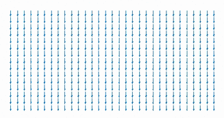

>അത്യാവശ്യമായി ഒരു അയ തൂക്കാനായി ഒരു മുഴം പഴയ കയർ തപ്പിയെടുക്കുമ്പോഴോ, പാട്ട്  കേൾക്കാൻ ഒരു ഈയർഫോൺ തപ്പിയെടുക്കുമ്പോഴോ ഒക്കെ ഒരു ശല്യമായി  കടന്ന് വരുന്ന ഒന്നാണ് കെട്ടുപിണയുക എന്നത്!

നമ്മൾ ഒരുചരടിൽ കെട്ടിടണം എന്ന് വച്ചാലോ, രണ്ടറ്റവും കോർത്ത് തന്നെ വേണം താനും. ശാസ്ത്രം പറയുന്നു നാം സ്വയം പഴിക്കേണ്ട കാര്യമില്ല പകരം ഇത് ഒരു ഭൗതിക അനിവാര്യത മാത്രമാണെന്ന്. ക്രമത്തിൽ നിന്ന് ക്രമഭംഗത്തിലേക്ക് ഭൗതിക ലോകം മുന്നേറുന്നുവെന്ന് പ്രതിപാദിക്കുന്ന രണ്ടാമത്തെ താപ നിയമമാണ് (Second Law of Thermodynamics) ഒരു കാരണം. ചരടുകൾ കെട്ടുപിണയുന്നത് നാം അവയെ എടുക്കാനായി ശല്യപ്പെടുത്തുമ്പോഴാണ് (Agitation of their states). ചരടുകൾ കെട്ടുവീഴുന്നത് മുതൽ ഡിഎൻഎ വരെയുള്ളവയുടെ ചുരുളുകൾ പഠിക്കുന്ന ഗണിത രൂപമായ ടോപ്പോളജിയിലെ (Toplogy) ഒരു ഭാഗമാണ് കെട്ട്  സിദ്ധാന്തം (Knot Theory). ഒറ്റ വാക്കിൽ പറഞ്ഞാൽ ഒരു ജ്യാമിതീയ സ്വഭാവത്തിന്റെ പടിപടിയായുള്ള വ്യതിയാനത്തിന്റെ പഠനമാണ് ടോപ്പോളജി. എന്നാലിതിന്റെ ഗണിതരൂപം നമ്മൾക്ക് പരിചിതപുള്ള രൂപത്തിലല്ല, മാത്രവുമല്ല ടോപ്പോളജിയിലെ കെട്ട് എന്നത് രണ്ടറ്റവും കൂട്ടിക്കെട്ടിയ ത്രിമാന രൂപമാണ്. 

> <a href="http://www.bendweekly.com/Science/11613.html"> [കെട്ടുകളെക്കുറിച്ച് ഗണിതവും, ഭൗതിക ശാസ്ത്രവും എന്ത് പറയുന്നുവെന്ന് ഇവിടെ വായിക്കാം]

	
ജ്യാമിതീയ ഗണിതം (Geometry) രൂപങ്ങളുടെ സ്വഭാവവിശേഷങ്ങളെപ്പറ്റി പഠിക്കുന്നുവെങ്കിൽ, ടോപ്പോളജി ജ്യാമിതീയ രൂപങ്ങളുടെ രൂപാന്തരങ്ങളെ പഠിക്കാൻ സഹായിക്കുന്നു. കുഴച്ച മാവ് ഉപയോഗിച്ച് നാം ഒരു ഉഴുന്ന് വട ഉണ്ടാക്കുന്നെന്ന്   കരുതുക. ഒരു ഉരുള മാവ് നമുക്ക് വേണമെങ്കിൽ വെറുതെ പരത്തി വറുത്തെടുക്കാം, ഒരു പരിപ്പ് വട  പോലെ. ഇനി ഒരു തുള, രണ്ട് തുള എന്നിങ്ങനെ നമ്മുടെ ഭാവന അനുസരിച്ച് നിരവധി വടകൾ ഉണ്ടാക്കിയെന്ന് കരുതുക. ടോപ്പോളജി അനുസരിച്ച് ഒരു തുള ഉള്ള വടയും ഒരു പിടിയുള്ള ചായക്കപ്പും, ഒക്കെ ഒരേ അവസ്‌ഥ തന്നെയാണ്. എന്നാൽ, തുളകൾ ഇല്ലാത്ത അവസ്ഥയോ, രണ്ട് തുളകൾ ഉള്ള അവസ്ഥ എന്നിവ ഇവയ്ക്ക് തുല്യമാണ്. ഇങ്ങിനെയുള്ള വ്യത്യസ്ഥ അവസ്ഥകൾ തമ്മിൽ രൂപാന്തരണം നടക്കണമെങ്കിൽ നമുക്ക് മാവ് പൊട്ടിക്കുക തന്നെ വേണം. ഉദാഹരണത്തിന് ഒരു ഉഴുന്നുവട പൊട്ടിച്ചാൽ അത് തുളകൾ ഇല്ലാത്ത അവസ്ഥയിലേക്ക് മാറുന്നു. അതായത്, ഒരു അവസ്ഥയിൽ ഒരു ജ്യാമിതീയ രൂപത്തിന്റെ സ്വഭാവ വിശേഷങ്ങൾ തുടർച്ചയായി മാറുന്നു, ഒരു പിടി മാവ് വലിച്ച് നീട്ടുന്നത് പോലെ. എന്നാൽ മറ്റൊരാവസ്ഥയിലേക്ക് മാറണമെങ്കിൽ ഒരു പൊട്ടൽ വേണമെന്ന് കാണാം. ഇതെല്ലാം ഗണിതശാസ്ത്ര സങ്കല്പങ്ങളാണെകിലും ടോപ്പോളജിയിലെ ചില സിദ്ധാന്തങ്ങൾ ഇവയെ ജ്യാമിതീയ രൂപങ്ങളുമായി ബന്ധിപ്പിക്കുന്നു.

ഇങ്ങിനെയെങ്കിൽ, ദ്രവ്യത്തിന്റെ അവസ്ഥാ വിശേഷങ്ങൾക്കും അവയുടെ അവസ്ഥാന്തരങ്ങൾക്കും ടോപ്പോളജിയിൽ പ്രദിപാതിക്കുന്ന തരത്തിലുള്ള ഒരു വായന സാധ്യമാണോ?

***

## ഗണിതത്തിൽ നിന്ന് ദ്രവ്യത്തിലേക്ക്

ദ്രവ്യത്തിന്റെ അഞ്ചോ ആരോ അവസ്ഥകളെക്കുറിച്ച് (States of Matter) നാമൊക്കെ കേട്ടിരിക്കും. ഖരം, ദ്രാവകം, വാതകം, പ്ലാസ്മ എന്നീ അവസ്ഥകൾ ഏവർക്കും പരിചിതമാണെങ്കിലും ബോസ് ഐൻസ്റ്റൈൻ സാന്ദ്രീകരണം (Bose-Einstein Condesation), ഫെർമി സാന്ദ്രീകരണം (Fermi Condensatopn), അതിദ്രവത്വം (Superfulidity), അപകർഷ ദ്രവ്യം (Degenerate Matter), പ്രകാശ ദ്രവ്യം (Photonic Matter), ക്വാർക് - ഗ്ലുവോൺ പ്ലാസ്മ (Quark-Gluon Plasma), തുടങ്ങിയ ഭൗതികാവസ്ഥകൾ പരിചിതമായിരിക്കില്ല. ഭൗതിക ശാസ്ത്രജ്ഞർ ദ്രവ്യത്തിന്റെ നിരവധി അവസ്ഥകൾ പഠനവിധേയമാക്കാറുണ്ട്. ഏതാണ്ട് ഇരുപത്തിയാറോളം അവസ്ഥതകൾ ഇത്തരത്തിലുള്ളതായി കാണാം. ഇതിൽ ഭൂരിഭാഗവും നമ്മുടെ ഇന്ദ്രിയങ്ങൾക്ക് ഗോപ്യമല്ല എന്നതിനാൽ, സ്‌കൂൾ തലത്തിലുള്ള ഗണിതമോ, ഭൗതികശാസ്ത്രമോ ഉപയോഗിച്ച് ഇവയെ മനസ്സിലാക്കുക ദുഷ്കരമാണ്. 
ഡേവിഡ് ജെ. തൌലെസ്, എഫ്. ഡങ്കന്‍ ഹാല്‍ഡേന്‍, ജെ. മൈക്കല്‍ കോസ്റ്റര്‍ലിറ്റ്‌സ് എന്നീ ശാസ്ത്രജ്ഞർ 2016-ലെ ഭൗതികശാസ്ത്ര നോബൽ നേടിയത് ദ്രവ്യത്തിന്റെ അവസ്ഥാന്തരങ്ങളെ കൃത്യമായി വിശദീകരിക്കാനാവശ്യമായ ഗണിതശാസ്ത്ര സങ്കല്പങ്ങൾ ആവിഷ്കരിച്ചതിനും, അവയുപയോഗിച്ച് നിരവധി അവസ്ഥാന്തരങ്ങൾ വിവരിച്ചതിനുമാണ്.

> <a href="http://listverse.com/2015/08/03/10-unusual-states-of-matter/"> [ദ്രവ്യത്തിന്റെ ചില അസാധാരണ അവസ്ഥകളെപ്പറ്റി പ്രദിപാതിച്ചിരിക്കുന്നത് ഇവിടെ കാണാം]
	

***

## ഗൗസ് - ബോണറ്റ് സിദ്ധാന്തം
ഉപരിതലങ്ങളുടെ വക്രതയെ സംബന്ധിച്ച ഈ സിദ്ധാന്തം ജ്യാമിതീയ രൂപങ്ങളെ ടോപ്പോളജിയുമായി ബന്ധിപ്പിക്കുന്നതിനൊപ്പം, ടോപ്പോളജിയെ ഭൗതികശാസ്ത്രവുമായും ബന്ധിപ്പിക്കുന്നു. ക്വാണ്ടം സിദ്ധാന്തം സാധ്യമാക്കുന്ന ദ്വിമാന (Two Dimentional), ഏകമാന (One Dimensional) വസ്തുക്കളുടെ ഇലക്ട്രോണുകളുടെ ഊർജ്ജനിലയും മറ്റും ടോപ്പോളജീയ ഉപരിതലങ്ങളുടെ വക്രതയും, ദ്വാരങ്ങളുമായി താരതമ്യം ചെയ്ത് ഒരേ തരത്തിലുള്ള ഗണിതപ്രശ്നങ്ങളായി കണ്ട് പരിഹരിക്കാനായി എന്നതാണ് ഈ വർഷത്തെ നോബൽ ജേതാക്കളുടെ പ്രത്യേകത. ഈ അവസ്ഥകളെ ദ്രവ്യത്തിന്റെ ടോപ്പോളജീയ അവസ്ഥകൾ (Topological Phases of Matter) എന്ന് വിളിക്കുന്നു. ഈ അവസ്ഥകളും, ഇവയുടെ അവസ്ഥാന്തരങ്ങളും (Phase Transitions) കൃത്യമായി മനസ്സിലാക്കാൻ ഇവരുടെ പഠനങ്ങൾക്ക് സാധ്യമായി.

ദ്രവ്യ അവസ്ഥകളെ മനസ്സിലാക്കാൻ സാധാരണ അവയുടെ ഊഷ്മാവ്, മർദ്ദം, സാന്ദ്രത, മാത്ര എന്നിങ്ങനെയുള്ള ഭൗതിക അളവുകൾ തിട്ടപ്പെടുത്തുന്നത് വഴി സാധിക്കാറുണ്ട്. ഖര, ദ്രാവക, വാതക അവസ്ഥതകളിൽ ഇത് വളരെ എളുപ്പത്തിൽ സാധിക്കുമെന്ന് മാത്രമല്ല, പ്രാദേശികമായി അളന്നാലും മതിയാകും. എന്നാൽ ടോപ്പോളജീയ അവസ്ഥകളിൽ ഇത് സാധ്യമല്ല. ഉദാഹരണത്തിന്, ഒരു ഉഴുന്ന് വടയിലിരിക്കുന്ന ഉറുമ്പിന് അതിനെത്ര ദ്വാരങ്ങളുണ്ടെന്നോ, അതിന്റെ ഉപരിതല വക്രത എന്താണെന്നോ മനസിലാക്കാനാവില്ല. അതിന് ആ ഉപരിതലത്തിൻറെ ടോപ്പോളജീയ ബാഹ്യവീക്ഷണം തന്നെ ആവശ്യമാണ്. ഇത് ദ്രവ്യത്തിന്റെ കാര്യത്തിലും ടോപ്പോളജീയ ഗണിതം തന്നെ ഉപയോഗിക്കേണ്ടത്തിന്റെ അനിവാര്യത ചൂണ്ടിക്കാണിക്കുന്നു.

***

## ദ്രവ്യത്തിന്റെ അവസ്ഥാന്തരങ്ങൾ
അവസ്ഥാന്തരങ്ങൾ സംഭവിക്കുന്നത് ദ്രവ്യം ചില പ്രത്യേക ഭൗതിക സാഹചര്യങ്ങളിലൂടെ കടക്കുമ്പോഴാണ്. ഉദാഹരണത്തിന് അന്തരീക്ഷ മർദ്ദത്തിൽ നമ്മൾ പൂജ്യം ഡിഗ്രി സെൽഷ്യസിൽ ജലം തണുപ്പിച്ചാൽ ഹിമാവസ്ഥയിലേക്ക് പോകുന്നതായി കാണാം. ഇതിന്റെ ഫലമായി മാത്ര, താപചാലകശേഷി, സാന്ദ്രത, എന്നിങ്ങനെ പല സ്വഭാവവിശേഷങ്ങൾക്കും  മാറ്റം വരുന്നു. അവസ്ഥാന്തരം സംഭവിക്കുന്ന ഊഷ്മാവിനെ സാധാരണ ക്രാന്തി മൂല്യം (Critical Value) എന്ന് വിളിക്കുന്നു. 1920-കളിൽ കാമെർലിങ് ഓനെസും (Pyotr Leonidovich Kapitsa), കപിറ്റ്‌സയുമൊക്കെ (Heike Kamerlingh Onnes) തുടങ്ങി വച്ച ദ്രവ്യത്തിന്റെ താഴ്ന്ന ഊഷ്മാവിലുള്ള അവസ്ഥതകളെക്കുറിച്ചുള്ള പഠനം 1970 ആയപ്പോൾ ലെവ് ലാൻഡോയുടെയും (Lev Landau) സതീർത്ഥരുടേയും പഠന ഫലമായി ഏകദേശം മനസ്സിലാക്കാമെന്ന സ്ഥിതിയായിരുന്നു. ക്വാണ്ടം അവസ്ഥകളെ മനസ്സിലാക്കുക എന്നത് ഇതിനു ശേഷവും ദുഷ്കരമായി തുടർന്നു. ഇതിനു പ്രധാന കാരണം ത്രിമാന ലോകത്തിനു താഴെ ദ്രവ്യത്തിന്റെ അവസ്ഥാന്തരങ്ങൾ ഖര, ദ്രാവക, വാതക അവസ്ഥകൾ തമ്മിലുണ്ടാകുന്ന പോലെയുള്ള മാറ്റം സാധ്യമല്ല എന്നതാണ്. എന്നാൽ ഈ ക്വാണ്ടം അവസ്ഥാന്തരങ്ങളിൽ എന്തോ ഒരു മാറ്റം ഉണ്ടാവുന്നതായി ശാസ്ത്രജ്ഞർക്ക്  നിരീക്ഷിക്കാനായിരുന്നു. ഇത് സംബന്ധിച്ച പഠനങ്ങളിൽ ഒരു വിപ്ലവം ഉണ്ടായത് ദ്വിമാന, ഏകമാന അവസ്ഥാന്തരങ്ങളെ ടോപ്പോളജീയ ഗണിത സങ്കല്പങ്ങൾ ഉപയോഗിച്ച് മനസ്സിലാക്കാം എന്ന കണ്ടെത്തലായിരുന്നു.

ഈ പരിഹാരം എത്തിയത് തൌലെസും കോസ്റ്റർലിറ്സും ചേർന്ന് മുന്നോട്ട് വച്ച ചുഴികൾ പോലെയുള്ള ടോപ്പോളജിയ ന്യൂനതകൾ (Topological Defects) വഴിയാണ്. 

***

## ടോപ്പോളജീയ അവസ്ഥാന്തരം
 
 1972-ൽ തൗലെസ്സും കോസ്റ്റർലിറ്സും ചേർന്ന് ദ്വിമാന പദാർത്ഥങ്ങളിൽ അതിചാലകത സാധ്യമാണെന്ന് കണ്ടെത്തി. മിക്കവാറും അതിചാലകങ്ങളൊക്കെ ദ്വിമാന അടുക്കുകളായി നിർമ്മിക്കുന്നതിനാൾ അവയെ ദ്വിമാന അവസ്ഥകളായി കാണാവുന്നതാണ്. സാധാരണ, ഊഷ്മാവ് ഒരു ക്രാന്തി മൂല്യത്തിനു (Critical Value) മുകളിൽ പോയാൽ അതിചാലകത നശിക്കുന്നു. താപനില ഈ മൂല്യം കടക്കുമ്പോൾ കോസ്റ്റർലിറ്റ്‌സ് - തൗലെസ്സ് അവസ്ഥാന്തരം സംഭവിക്കുന്നു. പൂജ്യം കെൽവിനടുത്ത ഊഷ്മാവിൽ താപോർജ്ജം ചെറിയ അളവിൽ ലഭിക്കുന്നത് ഇലക്ട്രോണുകളുടെ തരംഗമണ്ഡലത്തിൽ ന്യൂനതകൾ സൃഷ്ടിക്ക്കും. ഈ ന്യൂനതകൾ തരംഗമണ്ഡലത്തിൽ ചുറ്റിത്തിരിയുന്ന ചുഴികളായാണ് പ്രത്യക്ഷപ്പെടുക. ഒരിക്കൽ ഉണ്ടായാൽ നശിപ്പിക്കാനാവാത്ത വിധം സ്ഥിരതയുള്ളവയാണ് ചുഴികൾ (Vortices). ഈ ചുഴികളും പക്ഷെ അതിചാലകതയ്ക്ക് കാരണമാകുന്ന ഇലക്ട്രോൺ ജോടികളുടെ അതിദ്രവത്വം നശിപ്പിക്കുകയല്ല, പകരം എതിർ-ചുഴികളുമായി (Anti-Vortices) ചേർന്ന് പരസ്പരം ഇല്ലാതാക്കുകയും, ഇതുവഴി തരംഗമണ്ഡലത്തിന്റെ ടോപ്പോളജിയ ക്രമം (Topological Order) മാറ്റാതെ അതിചാലകത നിലനിർത്താൻ സഹായിക്കുന്നുവെന്ന് ഇവർ അനുമാനിച്ചു. ഇവ്വിധത്തിൽ ദ്വിമാന അവസ്ഥകളിൽ എങ്ങിനെ അതിചാലകതയും, അതിദ്രവത്വവും ഉണ്ടാകുന്നതെന്ന് വിവരിക്കാൻ ഇവർക്കായി. 
 
 ടോപ്പോളജീയ അവസ്ഥകൾ രൂപപ്പെടുന്ന അതിചാലകങ്ങൾ (Supercondcutors), അതിദ്രാവകങ്ങൾ (Superfluids), കാന്തിക വസ്തുക്കൾ (Magnetic materials) എന്നിവയിലൊക്കെ ടോപ്പോളജിയ ന്യൂനതകൾ വഴി നിരവധി ചുഴികൾ രൂപപ്പെടുന്നു. തൌലെസിന്റെ സഹ ഗവേഷകനായിരുന്ന മാഴ്സൽ ഡെൻ നിജ്സിന്റെ (Marcel den Nijs) അഭിപ്രായത്തിൽ [3] ടോപ്പോളജീയ അവസ്‌ഥാന്തരത്തെ, നിരവധി നിലകളുള്ള, ചുറ്റിത്തിരിഞ്ഞ് കയറുന്ന, ഒരു കാർ പാർക്കിങ്ങ് കേന്ദ്രത്തോടുപമിക്കാം. കാർ പാർക്ക് ചെയ്‌യാനായി ആദ്യത്തെ നിലയിലെത്തുന്ന നമുക്ക് ചിലപ്പോൾ അവിടെ മൊത്തം കറങ്ങി നോക്കിയാൽ മാത്രമേ സ്ഥലമുണ്ടോ എന്ന് കണ്ടെത്താനാവൂ. ഇതിനായി നമ്മൾ ഒരു നെടുന്തൂണിന് ചുറ്റുമായിരിക്കും കറങ്ങി നോക്കുക. ഇതൊരു ചുഴിക്ക് (Vortex) സമാനമാണ്. ആ നിലയിൽ സ്ഥലം കണ്ടെത്താനായില്ലെങ്കിൽ നമ്മൾ അടുത്ത നിലയിലേക്ക് പോകുന്നു. 
 
 
 [ചുഴികളും എതിർ-ചുഴികളും ഉണ്ടാകുന്നതിന്റെ ചിത്രീകരണം]
 
## ടോപ്പോളജീയ ഭൗതികം

ക്രാന്തി മൂല്യത്തോടടുക്കുമ്പോൾ ചുഴികളും, എതിർ-ചുഴികളും പരസ്പരം ബന്ധിക്കപ്പെടുകയും, ഇലക്ട്രോണുകളുടെ അവസ്ഥകൾ അവയോട് ക്രമപ്പെടുകയും ചെയ്യുന്നു. ഇത് സാധ്യമാക്കുന്ന ഊഷ്മാവിന് മുകളിൽ ഒരു ചുഴിയും എതിർ-ചുഴിയുമുണ്ടാകുന്നത് ശൂന്യതയിൽ (Vacuum) നിന്ന് കണികയും (Particle) അതിന്റെ എതിർ-കണികയും (Antiparticle) ഉണ്ടാവുന്നതിനോട് ഉപമിക്കാവുന്നതാണ്. ടോപ്പോളജീയ സ്വഭാവങ്ങൾ മൊത്തം സഞ്ചരിച്ചാൽ മാത്രം മനസ്സിലാവുന്നത് പോലെ ഒരു ക്വാണ്ടം അവസ്ഥയിൽ ചുഴികളുണ്ടാവുന്നതൊരു ടോപ്പോളജീയ പ്രതിഭാസമാണെന്നും, ഇലക്ട്രോണുകളും മറ്റും അതിദ്രാവകങ്ങളിലും മറ്റുമുണ്ടാകുന്ന ചുഴികൾക്ക് ചുറ്റും സഞ്ചരിച്ച് അടുത്ത അവസ്ഥയിലേക്ക് മാറുന്നത് ടോപ്പോളജീയ സിദ്ധാന്തങ്ങൾ ഉപയോഗിച്ച് മനസ്സിലാക്കണമെന്നും വരുന്നു. അങ്ങിനെ ഭൗതിക ശാസ്ത്ര പഠനത്തിൽ അന്ന് വരെ ഉപയോഗിക്കാതിരുന്ന ഒരു ഗണിത ആയുധം കൈവശമായി. ദ്വിമാന തലത്തിൽ ഇവ്വിധം നടക്കുന്ന മാറ്റങ്ങളെ കെ-ടി അവസ്ഥാന്തരം (Kosterlitz – Thouless Transition) എന്നറിയപ്പെടുന്നു. ടോപ്പോളജിയ ദ്വാരങ്ങളുടെ സ്ഥിതിയുമായി ചേർത്ത് അനുമാനിച്ചാൽ ഒരു ദ്രവ്യാവസ്ഥയിലെ ചുഴിത്വം (Vorticity)  ഒരു സ്ഥിരാങ്കമാണ് (Invariant). ഉദാഹരണത്തിന്, ഒരു വടയിലുള്ള ദ്വാരങ്ങളുടെ എണ്ണം ഒരു ടോപ്പോളജീയ സ്ഥിരാങ്കമാണ്; വട മുറിക്കാതെ അവയുടെ എണ്ണം മാറ്റാൻ നമുക്കാവില്ല. ഈ അവസ്ഥാന്തരത്തിനു മുമ്പും അതിനു ശേഷവുമുള്ള ചുഴികൾ വ്യത്യസ്തമായതിനാൽ ആ അവസ്ഥകളുടെ ടോപ്പോളജിയും വ്യത്യസ്ഥമായിരിക്കുമെന്നും, ഇവയുടെ പരസ്പരമുള്ള അവസ്ഥാന്തരം ഒരു ചാട്ടത്തിലൂടെ മാത്രമേ സാധിക്കൂ എന്നിവർ കണ്ടെത്തി. ഇത് എല്ലാത്തരം ദ്വിമാന, ഏകമാന അവസ്ഥകളിലും വ്യാപകമാണെന്ന് കണ്ടെത്തിയതോടെ ഈ പഠനങ്ങൾ ഭൗതിക ശാസ്ത്ര ലോകത്ത് വ്യാപകമായി. 

ഒരു ദശകത്തിനു ശേഷം തൌലെസും കൂട്ടരും ഇതേ സിദ്ധാന്തം 1980-ൽ കണ്ടെത്തിയ ക്വാണ്ടം ഹാൾ പ്രഭാവം (Quantum Hall Effect) വിവരിക്കാൻ ഉപയോഗപ്പെടുത്തി. ഒരു കാന്തിക മണ്ഡലത്തിൽ വച്ചിട്ടുള്ള ഒരു അർദ്ധചാലകത്തിൽ വിലങ്ങനെയുള്ള ദിശയിൽ ഒരു വൈദ്യുതപ്രവാഹം കടത്തിവിട്ടാൽ ഇതിനു രണ്ടിന് ലംബമായി ഒരു വോൾട്ടേജ് രൂപപ്പെടുന്നതാണ് ഹാൾ പ്രഭാവം (Hall Effect). എന്നാൽ ദ്വിമാനപാളികളിൽ, വളരെ താഴ്ന്ന ഊഷ്മാവിൽ, വോൾട്ടേജ്  വ്യതിയാനം തുടർച്ചയായല്ല എന്ന് കണ്ടെത്തി. ഇത് ക്വാണ്ടം ഹാൾ പ്രഭാവം എന്നറിയപ്പെടുന്നു. 1983-ൽ ക്വാണ്ടം ഹാൾ പ്രതിഭാസം ദ്രവ്യാവസ്ഥയുടെ ടോപ്പോളജിക്കൽ പ്രഭാവം മൂലമാണെന്ന് തെളിയിക്കാൻ തൗലീസിനായി. ഇത് വഴി വോൾട്ടേജ് വ്യതിയാനം പടിപടിയായി (Integer or Quantum Jump) ആണുണ്ടാകുന്നതെന്ന നിരീക്ഷണം വിശദീകരിക്കാൻ അദ്ദേഹത്തിനായി. ടോപ്പോളജീയ സ്ഥിരാങ്കങ്ങൾക്ക് ഇതിലുള്ള പ്രാധാന്യം എടുത്ത് കാട്ടാൻ ഇവർക്കായി. 

## ഏകമാന ലോകവും, സാധ്യതകളും

തൌലെസ്, കോസ്റ്റര്‍ലിറ്റ്‌സ് എന്നിവരുടെ ദ്വിമാന ലോകത്തെ പഠനങ്ങളിൽ ആകൃഷ്ടനായ ഹാല്‍ഡേ ഏകമാന വസ്തുക്കളെ (One-Dimensional Materials) ഒരു മാതൃകയാക്കി പഠനമാരംഭിച്ചു. ഇതിന്റെ ഫലമായി ടോപ്പോളജിക്കൽ വിദ്യുത്‌രോധികൾ (Topologial Insulators) രൂപം കൊണ്ടു. അരികുകളിൽ വൈദ്യുതി കടത്തിവിടുകയും, ഉള്ളിൽ അതിനെ പ്രതിരോധിക്കുകയും ചെയ്യുന്ന നിർമ്മിതികളാണ് ടോപ്പോളജിക്കൽ വിദ്യുത്‌രോധികൾ. ഇത് വഴി ടോപ്പോളജി നിയന്ത്രിച്ച് പദാർത്ഥങ്ങളുടെ ഭൗതിക സ്വഭാവത്തിന് മാറ്റം വരുത്തുന്ന ഒരു പഠന ശാഖ തന്നെ ഉരുത്തിരിഞ്ഞു വന്നു. മാത്രവുമല്ല, ടോപ്പോളജിക്കൽ ഭൗതികശാസ്ത്രം (Topologial Physics) എന്ന ഒരു മേഖലയിലുള്ള താല്പര്യം ഒരു വിസ്ഫോടനത്തിന് സാക്ഷ്യം വഹിച്ചു, നാനോ ടെക്‌നോളജിയുടെയും, ക്വാണ്ടം കമ്പ്യൂട്ടിങ്ങിന്റെയും വരവാണിതിന് മുഖ്യ കാരണം. നിരവധി നാനോ പദാർത്ഥങ്ങളുടെ നിർമ്മാണം ധാരാളം അവസ്‌ഥകളും, അവസ്ഥാന്തരങ്ങളും സൃഷ്ടിക്കാൻ ശാസ്ത്രജ്ഞരെ പര്യാപ്തരാക്കി. ഈ വർഷത്തെ നോബൽ ജേതാക്കളെ ഈ നേട്ടത്തിന് പ്രാപ്തരാക്കിയതിൽ ഇതൊരു മുഖ്യ ഘടകമാണ്. 

അതിചാലകങ്ങൾ ഉപയോഗിച്ച് ശക്തിയേറിയ കാന്തങ്ങൾ നിർമ്മിക്കാനാകുന്നത് ടൈപ്പ് രണ്ട് അതിചാലകങ്ങളിൽ (Type-II Supercondcutors) രൂപം കൊള്ളുന്ന ചുഴികളാണ്. ടൈപ്പ് ഒന്ന് അതിചാലകങ്ങൾ (Type-I Supercondcutors) ശക്തിയേറിയ കാന്തിക മണ്ഡലത്തിൽ അതിചാലകത നശിക്കുന്നെങ്കിൽ ടൈപ്പ് രണ്ട് അതിചാലകങ്ങളിൽ രൂപപ്പെടുന്ന ചുഴികൾ കാന്തിക മണ്ഡലങ്ങളെ കടത്തി വിട്ട് അതിചാലകത നശിക്കാതെ സഹായിക്കുന്നു. ഇത് ശക്തിയേറിയ എംആർഐ (MRI) സ്‌കാനിങ്‌ യന്ത്രങ്ങൾ ഉണ്ടാക്കാൻ നമ്മെ സഹായിക്കുന്നു. ക്വാണ്ടം ക്യുബിറ്റുകളെ (Qubit) സൃഷ്ടിക്കാൻ ടോപ്പോളജീയ അവസ്ഥകളെ ഉപയോഗിക്കുക എന്നത് സജീവമായ ഒരു ഗവേഷണ വിഷയമാണ്.  എന്നാലിതെല്ലാം വളരെ താഴ്ന്ന ഊഷ്മാവിൽ മാത്രമേ ദൃശ്യമാകൂ എന്നത് സാധാരണക്കാർക്ക് ഇതിന്റെ വ്യാപ്തി മനസ്സിലാക്കാൻ ഒരു തടസ്സമാണ്. എന്നിരിക്കലും ഭൗതിക ശാസ്ത്രത്തിന്റെ ഭാഷ ഗണിതത്ത്തിന്റെ അമൂർത്ത തലങ്ങൾ ഉപയോഗിച്ച് വർണ്ണിക്കുക എന്ന പാരമ്പര്യത്തെ ടോപ്പോളജിയുടെ തലങ്ങളിലേക്ക് എത്തിച്ച മൂന്ന് പ്രതിഭകളാണ് ഈ വർഷത്തെ വിജയികൾ എന്ന് നമുക്കോർക്കാം. 

***

## അവലംബം

1. M. Nakahara, 'Geometry, Topology, and Physics,' Sec. Edn., IoP Publishing Ltd.,Bristoll, 2003.
2. Evelyn Lamb, October 10, 2016, The Scientific Amercian: https://www.scientificamerican.com/article/bagels-pretzels-and-the-nobel-prize-in-physics
2. The American Physical Society, October 7, 2016• Physics 9, 116: http://physics.aps.org/articles/v9/116
3. D. J. Thouless, M. Kohmoto, M. P. Nightingale, and M. den Nijs, 'Quantized Hall Conductance in a Two-Dimensional Periodic Potential,'  Phys. Rev. Lett. 49, 405 (1982).
4. F. D. M. Haldane, 'Nonlinear Field Theory of Large-Spin Heisenberg Antiferromagnets: Semiclassically Quantized Solitons of the One-Dimensional Easy-Axis Néel State,' Phys. Rev. Lett. 50, 1153 (1983).
5. N. Shaji, http://luca.co.in/2016physics-nobel-detailed
